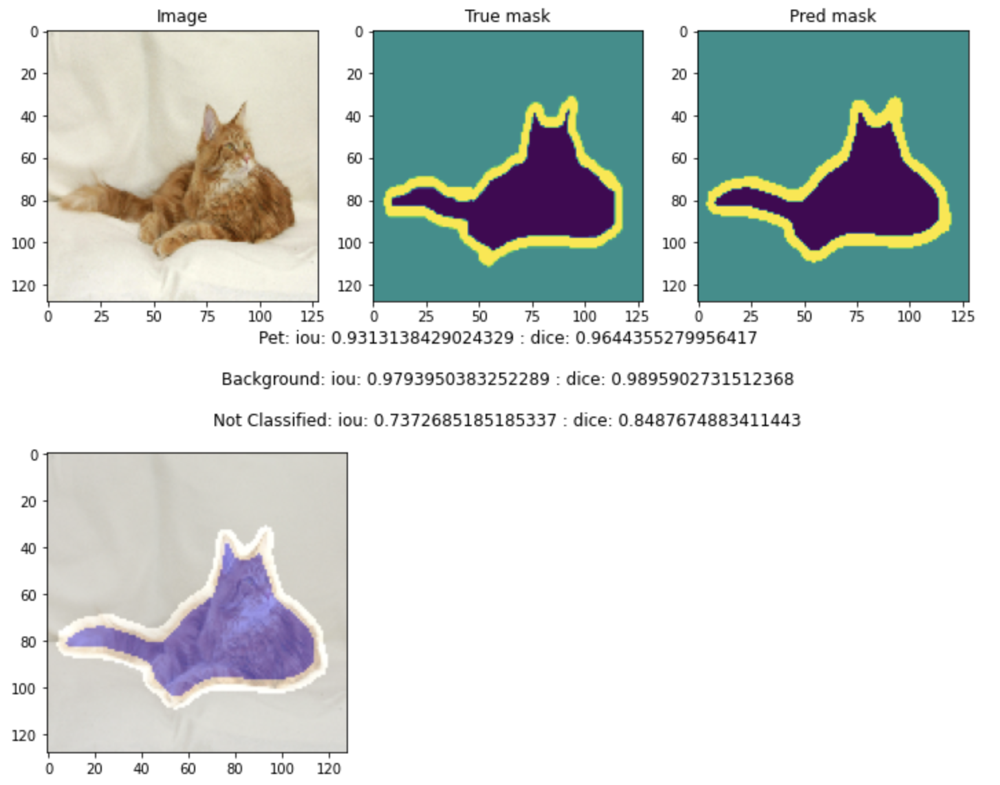
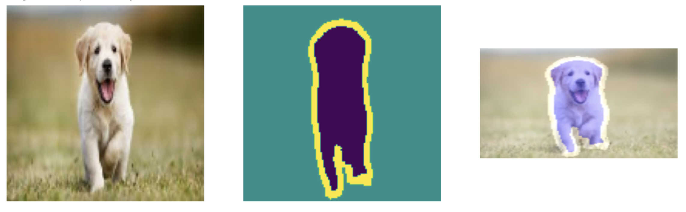

# Semantic-Image-Segmentation-UNet
## Introduction
The project in this repository applied UNet for semantic image segmentation based on the  Oxford Pets - IIT dataset dataset(see: https://www.robots.ox.ac.uk/~vgg/data/pets/). The dataset contain pet images, their classes and segmentation masks. The pixels in the segmentation mask are labeled as {1:Pet, 2:Background, 3:Outline(Not classified)}. The total number of examples is 7349 and splited to 3680 for training and 3669 for testing.

## Training results and predictions(Overlap the mask and content image)

#### Predict on test set:

#### Predict the dog image from internet(Source:https://www.parttimely.com/cute-dog-pictures-gallery-images-hd-photos/)

